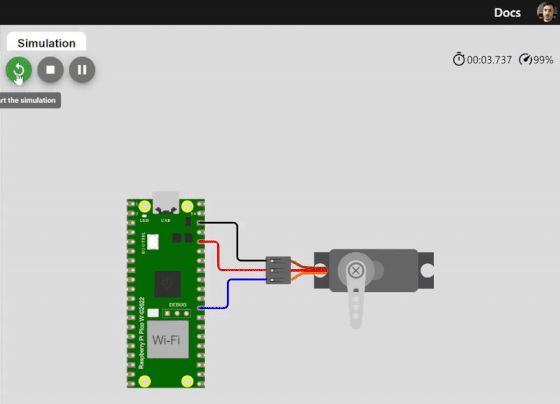
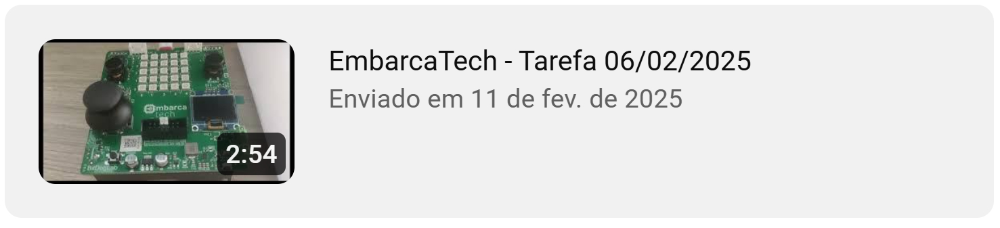

<h1 align="center">Embarcatec | Tarefa Aula Sincrona 06/02/2025</h1>

<div align="center">  
  
</div>

## Objetivo do Projeto

Com o emprego do módulo PWM (Pulse Width Modulation), presente no microcontrolador RP2040 da Raspberry Pi Pico W, foi projetado um sistema com a ferramenta Pico SDK para simular o controle do ângulo de um servomotor. Esta simulação contempla o motor micro servo padrão, presente no simulador de eletrônica online Wokwi.


## 🗒️ Lista de requisitos

- Cabo USB
- Servomotor
- Placa Bitdoglab ou os itens abaixo:
    - Protoboard;
    - Fios e jumpers; 
    - Microcontrolador Raspberry Pi Pico W; 

## 🛠 Tecnologias

1. **Git e Github**;
2. **VScode**;
3. **Linguagem C**;
4. **Extensões no VScode do Raspberry Pi Pico Project e CMake**

## 💻 Instruções para Importar, Compilar e Rodar o Código Localmente

Siga os passos abaixo para clonar o repositório, importar no VS Code usando a extensão do **Raspberry Pi Pico Project**, compilar e executar o código.

1. **Clone o repositório para sua máquina local**  
   Abra o terminal e execute os comandos abaixo:
   ```bash
   git clone https://github.com/alexsami-lopes/EmbarcaTech-Tarefa-Aula-Sincrona-06-02-2025.git
   cd EmbarcaTech-Tarefa-Aula-Sincrona-06-02-2025

2. **Abra o VS Code e instale a extensão "Raspberry Pi Pico Project" (caso não já a tenha instalada)**
 - No VS Code, vá até "Extensões" (Ctrl+Shift+X)
 - Pesquise por "Raspberry Pi Pico Project"
 - Instale a extensão oficial

3. **Importe o projeto no VS Code**
 - No VS Code, na barra lateral do lado esquerdo clique em "Raspberry Pi Pico Project" 
 - No menu que aparecer clique em 
 - Clicando em "Change" escolha a pasta clonada do repositório
 - Escolha a versão do SDK 2.1.0
 - Clique em "Import"


    


4. **Compile o projeto**
 - Com o projeto aberto no VS Code, pressione 
 - Aguarde a finalização do processo de build

5. **Rode o código no Raspberry Pi Pico**
 - Conecte o Raspberry Pi Pico ao PC segurando o botão "BOOTSEL".
 - Arraste e solte o arquivo `.uf2`, localizado dentro da pasta "build" do seu projeto, gerado na unidade USB montada.
 - O código será carregado automaticamente e o Pico será reiniciado.
 - Caso tenha instalado o driver com o Zadig clique em "Run" ao lado do botão 


## 🔧 Funcionalidades Implementadas:

1. Considerando a GPIO 22, foi definida a sua frequência de PWM para, aproximadamente, 50Hz – período de 20ms.
2. Foi definido o ciclo ativo do módulo PWM para Ciclo de Trabalho (Duty Cycle) de 0,12%. Isto ajusta a flange (braço) do servomotor para a posição de, aproximadamente, 180 graus. Aguarda-se 05 segundos nesta posição.
3. Foi definido o ciclo ativo do módulo PWM para Ciclo de Trabalho (Duty Cycle) de 0,0735%. Isto ajusta a flange do servomotor para a posição de, aproximadamente, 90 graus. Aguarda-se 05 segundos nesta posição.
4. Foi definido o ciclo ativo do módulo PWM para Ciclo de Trabalho (Duty Cycle) de 0,025%. Isto ajusta a flange do servomotor para a posição de, aproximadamente, 0 graus. Aguarde-se 05 segundos nesta posição.
5. Após a realização das roninas anteriores, foi criada uma rotina para movimentação periódica do braço do servomotor entre os ângulos de 0 e 180 graus. Obs.: a movimentação da flange é suave.
6. Com o emprego da Ferramenta Educacional BitDogLab, foi feito um experimento com o código deste exercício utilizando o LED RGB – GPIO 12. Foi observado o comportamento da iluminação do referido LED e documentado no video abaixo.

## 💻 Desenvolvedor
 
<table>
  <tr>

<td align="center"><br /><sub><b> Alexsami Lopes </b></sub></a><br />👨‍💻</a></td>

  </tr>
</table>


## 🎥 Demonstração no Wokwi: 

<div align="center">
  <figure>  
    
    
<figcaption>

**Figura 1** - Demo **(acelerada)** do Projeto no Wokwi.com - Acessível em: https://wokwi.com/projects/422571582987113473
    </figcaption>
  </figure>
</div>


## 🎥 Demonstração na Placa (Video): 

<div align="center">
  <a href="https://youtu.be/Ka4Hq_S2rEc" target="_blank">
    
  </a>
</div>